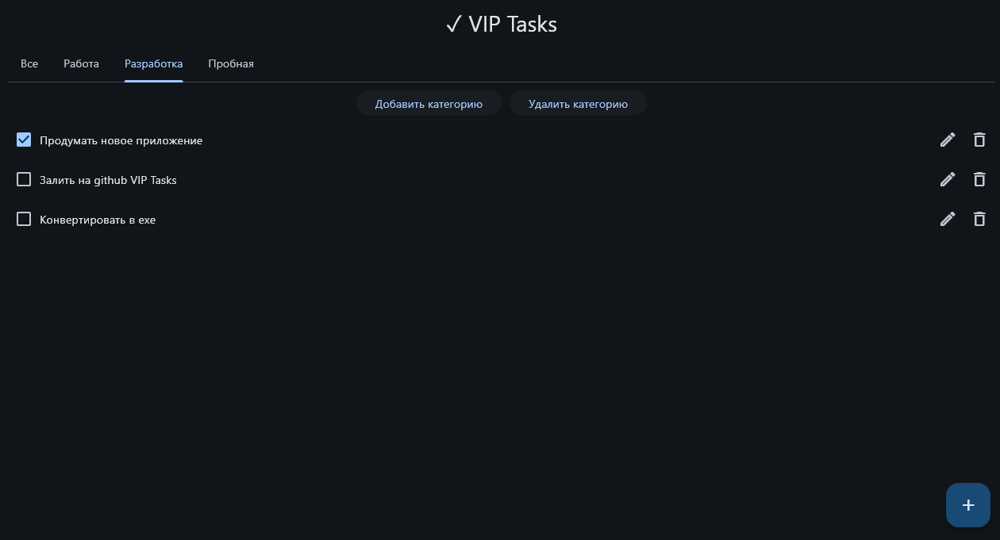

# VIP Todo


Desktop ToDo application built with Flet.

## Features

- ✅ Create tasks
- ✏️ Edit tasks
- 🗑 Delete tasks
- 📂 Categories
- 🔍 Filter by category
- ✔ Save completed status
- 💾 Automatic JSON persistence

## Screenshots



## Installation

1. Download the latest release from the **Releases** page.
2. Extract the archive to any folder.
3. Keep the executable inside that folder.
4. Run `VIP Todo.exe`.

> **Note:** The application stores tasks and categories in JSON files created in the same directory as the executable. If you move only the `.exe` file or run it from a temporary location, your data may not be saved as expected.

## Установка

1. Скачайте последнюю версию приложения со страницы **Releases**.
2. Распакуйте архив в удобное место.
3. Запустите `VIP Todo.exe`.

> **Важно:** Все данные приложения (задачи, категории и их состояние) сохраняются в файлах `tasks.json` и `category.json`, которые создаются рядом с исполняемым файлом. Поэтому рекомендуется не перемещать `.exe` отдельно от папки приложения.

## Running from source

```bash
git clone https://github.com/aleksejvyp/VIP-Tasks.git
cd VIP-Tasks
pip install -r requirements.txt
flet run
```

## Technologies

- Python
- Flet
- JSON
